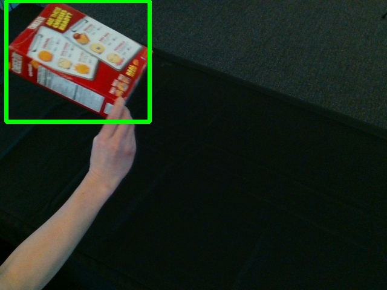
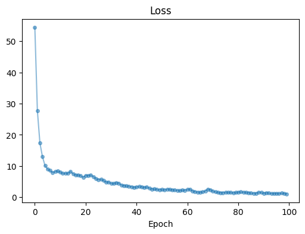
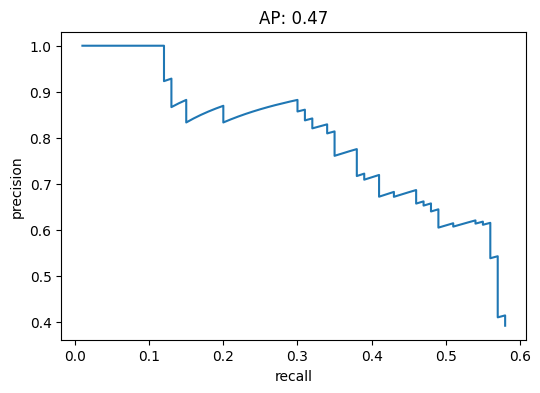
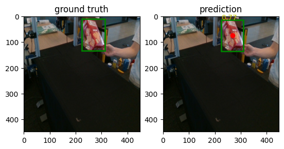
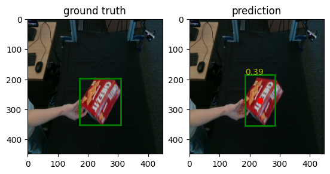

# CrackerBox YOLO

Hi. This is my implementation of the YOLO algorithm for object detection as a capstone project for my Computer Vision course.


## Dataset

We use a Cracker Box image dataset to train our model. For the purpose of conserving storage space, the dataset has been compressed and stored in the `data.zip` file, which contains 200 images of a cracker box in various positions and orientations in space. Each example consists of two (main) parts- `<id>.jpg`, a 640x480 image, and `<id>-box.txt`, a text file containing 4 values - `<starting-x> <starting-y> <width of bounding box> <height of bounding box>`. For visualization purposes, we also have a `<id>-gt.jpg` image, which is a 640x480 image with a bounding box around the cracker box.

|000023.jpg | 000023-gt.jpg|
------------------|-------------------------------|
| 


<br>
<br>

**000023-box.txt**
```text
10.95 1.76 247.77 202.00
```

## Neural Network
We use a Convolution Neural Network that I will not bother describing here, because it's 7 in the morning when I wrote this README, and I haven't slept all night. Anyways, the model architechture has been described [here](https://github.com/kraftpunk97/Yolo/blob/4d035b0b110684e72ef7909d795966e041a01ec5/yolo/model.py#L30) in the `model.py` file.

## Training and results

We train for 100 epochs, while using batch size of 8. We use half of our dataset for training and the other half for testing. 

The training progress has been recorded below<br>


We then use the trained model on the test dataset. We see that we achieve an average precision of **0.47**.<br>


Here is how our model performs with images from the test dataset, for which we provide no bounding box information.<br>



The trained model (weights) is available on [HuggingFace :hugs:](https://huggingface.co/kraftpunk97/CrackerBox-YOLO/tree/main).

While the python files are present in the `yolo` directory, there is also a standalone Jupyter notebook `YOLO.ipynb` for your reading pleasure. 

Thanks for your time :smiley:
